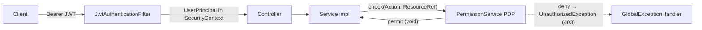
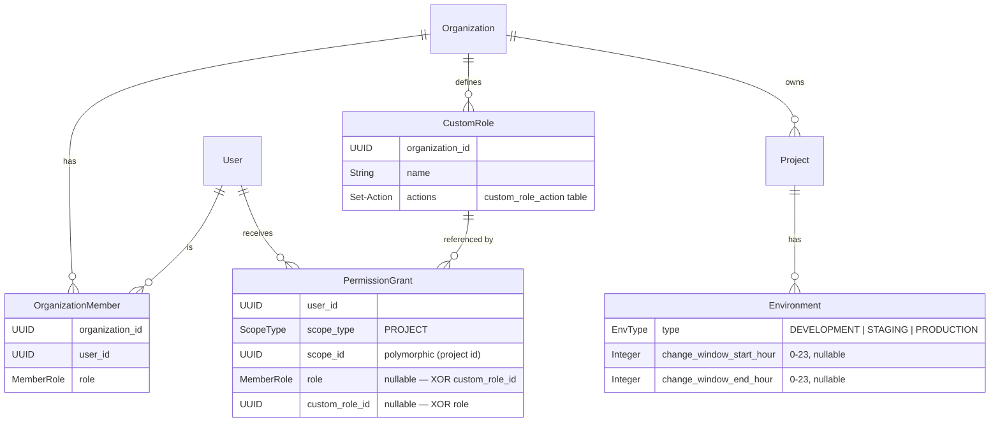
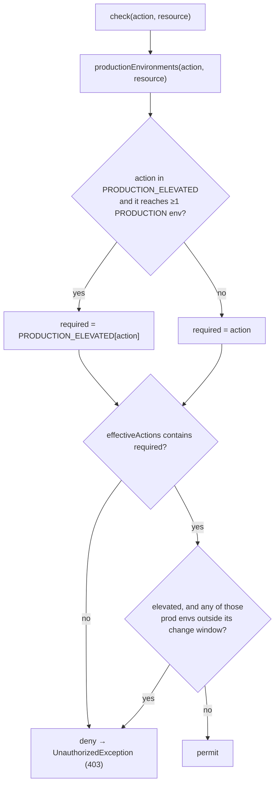
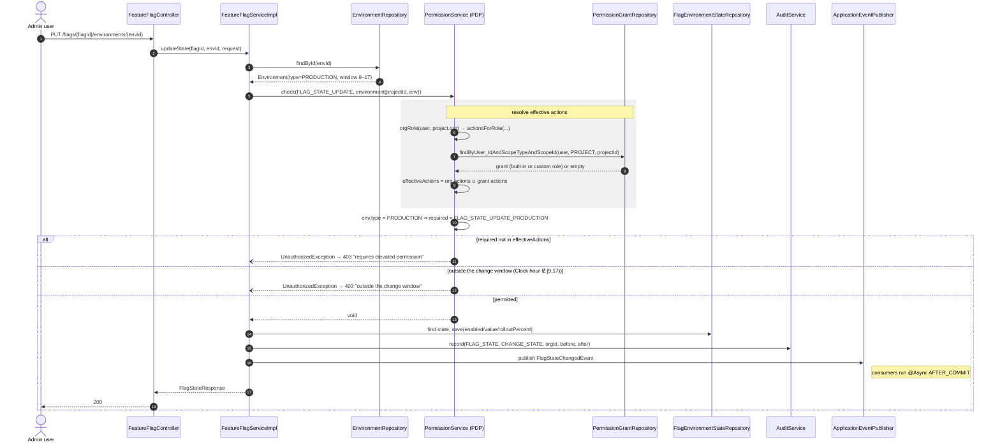
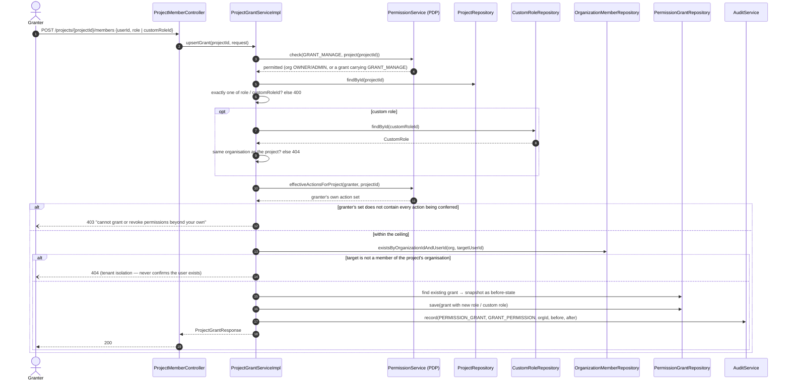

# Authorization (ABAC) — Architecture & Flow

Status: implemented on branch `feature/role`, merged up to `develop` (audit log, hashed API
keys, refresh tokens, pagination, metrics). Design spec:
[`docs/superpowers/specs/2026-07-02-abac-permissions-design.md`](superpowers/specs/2026-07-02-abac-permissions-design.md).

This document describes the Admin-API authorization model: how a request is authorized, the
data model behind it, the decision algorithm, the management APIs, and the security guards.

> Scope: this covers the **Admin API** (JWT-secured, human users). The **SDK API**
> (`/api/v1/sdk/**`, API-key-secured) is unaffected — it authenticates an `EnvironmentApiKey`
> (one of possibly several live keys per environment; see `CLAUDE.md` "API Key generation"), not
> a user, and does no per-action authorization. Creating and revoking those keys, however, *is*
> authorized through this PDP — see the `ENV_KEY_CREATE` / `ENV_KEY_REVOKE` rows below.

---

## 1. Model in one paragraph

Authorization is **attribute-based (ABAC)** and, concretely, **action-set based**. Every
protected operation is an [`Action`](#5-the-actionrole-matrix). For a given request, the
`PermissionService` (the **Policy Decision Point / PDP**) resolves the current user's
**effective set of actions** on the target resource, then checks whether the required action is
in that set. Effective actions come from the **union** of the user's organization role and any
**scoped grant** (a built-in role *or* a user-defined custom role). Two extra rules layer on
top: a **production capability** rule (changing a flag's state in a `PRODUCTION` environment
needs a distinct capability) and a **change-window** rule (production changes only inside a
configured time window).

This maps onto the four capabilities we set out to build:

| | Capability | Mechanism |
|---|---|---|
| **A** | Project-scoped access | `PermissionGrant` at `PROJECT` scope |
| **B** | Production protection | `FLAG_STATE_UPDATE_PRODUCTION` action, held by OWNER by default |
| **C** | Custom roles | `CustomRole` = a named set of `Action`s, referenced by a grant |
| **D** | Context conditions | Per-environment production **change window** (time-of-day) |

---

## 2. Where authorization lives



- The **admin `SecurityFilterChain`** validates the Bearer token and puts a `UserPrincipal`
  (with the user id) into the `SecurityContextHolder`. It does **not** do per-action checks.
- **Controllers contain no authorization logic** — they call the service layer.
- Each **service impl** calls `permissionService.check(action, resource)` before a protected
  operation. This is the single choke point (the PDP).
- A denied `check` throws `UnauthorizedException`, mapped by `GlobalExceptionHandler` to
  **HTTP 403**. Missing resources throw `ResourceNotFoundException` → **404**.

### The pre-ABAC adapters are still there

`requireRole(orgId, ...)`, `requireRoleForProject(projectId, ...)` and
`requireRoleForEnvironment(envId, ...)` were **not** removed — they are kept so call sites migrate
to `check` incrementally (design spec §6.5). After the merge with `develop`, `AuditService` is the
one remaining caller.

- `requireRole` is org-scoped, so it reads the org role only — grants never apply at org scope.
- The project and environment adapters resolve through `effectiveRoleForProject`, which returns the
  **more permissive** of the caller's org role and any built-in-role PROJECT grant. So a grant
  elevates an adapter call just as it elevates a `check`.
- A grant carrying a **custom role** has no built-in `MemberRole` to compare against, so it does
  **not** satisfy an adapter. Custom-role holders only get their capability through `check`.

New code should call `check`.

Key classes (`src/main/java/org/aibles/feature_flag/`):

| Concern | Type |
|---|---|
| PDP | `service/impl/PermissionService` |
| Actions | `domain/enums/Action` |
| Built-in roles | `domain/enums/MemberRole` (OWNER, ADMIN, VIEWER) |
| Scoped grant | `domain/entity/PermissionGrant`, `domain/enums/ScopeType` |
| Custom role | `domain/entity/CustomRole` |
| Env attributes | `domain/entity/Environment` (`type: EnvType`, change window) |
| Grant admin API | `service/ProjectGrantService`, `controller/admin/ProjectMemberController` |
| Custom-role admin API | `service/CustomRoleService`, `controller/admin/CustomRoleController` |
| Clock (for D) | `config/AppConfig#clock` |

---

## 3. Data model



Notes:

- **`OrganizationMember`** is the source of a user's **org-level** role and of membership.
  Untouched by this work — full backward compatibility.
- **`PermissionGrant`** elevates a user on a specific **project**. Exactly one of `role`
  (built-in) or `custom_role_id` is set (DB `CHECK` + service validation). `scope_id` is a
  polymorphic reference (project id today; no DB FK, so `ENVIRONMENT` scope can be added later).
- **`CustomRole`** is an org-scoped named set of `Action`s (`custom_role_action` join table).
- **`Environment.type`** drives production protection; the **change window** drives rule D.

### Liquibase changesets

| # | File | Adds |
|---|---|---|
| 014 | `014-add-environment-type.xml` | `environments.type` (default `DEVELOPMENT`) |
| 015 | `015-create-permission-grants.xml` | `permission_grant` table |
| 016 | `016-create-custom-roles.xml` | `custom_role`, `custom_role_action` |
| 017 | `017-permission-grant-custom-role.xml` | `permission_grant.custom_role_id`, `role` made nullable, XOR check |
| 018 | `018-add-environment-change-window.xml` | `environments.change_window_start_hour` / `_end_hour` |

*(Numbering corrected: `013` is `013-add-flag-hygiene-columns.xml`, issue #37, unrelated to ABAC —
this table previously listed these five changesets one number too low.)*

No previously-run changeset was modified; no data was migrated by 013–018.

Two more changesets, added by the API-key-lifecycle branch, are **adjacent** to this model
(`ENV_KEY_CREATE`/`ENV_KEY_REVOKE` guard the endpoints they back) but not part of it:

| # | File | Adds |
|---|---|---|
| 019 | `019-create-environment-api-keys.xml` | `environment_api_key` table (multiple keys per environment) |
| 020 | `020-migrate-api-keys-to-key-table.xml` | backfills from `environments.api_key_hash`, then drops that column and `environments.last_used_at` |

See `CLAUDE.md` ("API Key generation") for the key lifecycle itself; this document only covers who
is allowed to call it.

---

## 4. Decision flow — `check(Action, ResourceRef)`

`ResourceRef` names the resource and its scope: `org(orgId)`, `project(projectId)`, or
`environment(projectId, environment)` (the last carries `Environment` attributes for rules
B and D).



### `effectiveActions` — how the action set is built

```
effectiveActions(user, project) =
      actionsForRole( orgRole(user, project.org) )        // org-level role, if a member
    ∪ grantActions( grant(user, PROJECT, project) )       // built-in OR custom role, if granted

effectiveActions(user, org)     =
      actionsForRole( orgRole(user, org) )                // org scope: grants do not apply
```

- **Union ⇒ grants only elevate.** A scoped grant can only *add* capability; it never
  downgrades an org OWNER/ADMIN. Org OWNER/ADMIN keep seeing everything.
- **Project isolation (A)** is delivered by granting a **non-member** (their org role is empty,
  so their only actions come from the grant) — but note grants can only target **org members**
  (see [§7](#7-security-guards)); pure "invisible to non-granted projects" read isolation is a
  deferred enhancement.
- **Org scope ignores project grants and custom roles**, so a project-scoped role can never
  confer an org-level action such as `ORG_DELETE`.

### Rule B — production capability

An action that would change what a production SDK sees is rewritten to require a distinct,
elevated counterpart. `PermissionService.PRODUCTION_ELEVATED` is the whole table:

| Action | Elevated to | Why it reaches production |
|---|---|---|
| `FLAG_STATE_UPDATE` | `FLAG_STATE_UPDATE_PRODUCTION` | changes the flag's value/enabled state there |
| `FLAG_ARCHIVE` | `FLAG_ARCHIVE_PRODUCTION` | archived flags are filtered out of every evaluation response, so archiving is an off-switch |
| `ENV_ROTATE_KEY` | `ENV_ROTATE_KEY_PRODUCTION` | invalidates the key every production SDK authenticates with |
| `ENV_DELETE` | `ENV_DELETE_PRODUCTION` | removes the environment outright |
| `ENV_KEY_CREATE` | `ENV_KEY_CREATE_PRODUCTION` | issues a new credential a production SDK can authenticate with |
| `ENV_KEY_REVOKE` | `ENV_KEY_REVOKE_PRODUCTION` | withdraws a credential a production SDK is authenticating with — an off-switch, like archiving |

`POST /environments/{id}/import` is not a separate action: it is authorized as the operations it
performs — `FLAG_CREATE` plus `FLAG_STATE_UPDATE` against the target environment — so a real
import inherits both rules. A dry run stays project-scoped (it writes nothing), so an import can
still be planned outside the change window.

Only OWNER holds the elevated actions by default; a **custom role can opt into any of them**
deliberately. ADMIN can still archive, rotate and toggle in dev/staging. This is why B and C
share one mechanism instead of a special-cased `role == OWNER` check.

**Guarding only `FLAG_STATE_UPDATE` is not enough**, which is what the first cut did: an ADMIN
denied a production toggle could archive the flag instead and get the same outcome. Any new
action that alters production behaviour must be added to the table.

### Which environments an action is measured against

- **Environment-scoped call sites** (`updateState`, `rotateApiKey`, environment `delete`) name
  their target with `ResourceRef.environment(...)`, and only that environment is considered. A
  call site that passes `ResourceRef.project(...)` for one of these actions silently disables
  rules B and D — `EnvironmentServiceImplTest` pins both against that regression.
- **Project-scoped call sites** (`archive` / `unarchive`) reach every environment beneath the
  project, so every `PRODUCTION` environment there is resolved and considered; **one closed
  window denies the action** (strictest wins). The lookup is skipped for any action outside the
  table, so the common path costs no extra query.
  - ⚠️ Disjoint windows across two production environments (`9–12` and `13–17`) leave no hour at
    which archiving is permitted. An OWNER can widen or clear a window (`ENV_UPDATE` is not
    window-guarded) and then archive; a custom role without `ENV_MANAGE_PROTECTION` cannot.
    See the ADR-0006 amendment for why this was preferred over skipping rule D here.

### Rule D — production change window

If a production environment in scope sets both `changeWindowStartHour` and
`changeWindowEndHour`, an elevated action against it is only permitted when the current local
hour is inside `[start, end)`. The window applies to **every** action rule B elevates, not just
state changes — with exactly one exception, below.
Windows may wrap past midnight (`start > end`, e.g. `22–06`). `start == end` (or an unset
window) means **no restriction** — never a permanent lock-out. Time comes from an injectable
`Clock` bean, so it is unit-testable.

#### The one exception: revoking a production key skips the window

`PermissionService.WINDOW_EXEMPT` is a `Set<Action>` containing exactly one member,
`ENV_KEY_REVOKE_PRODUCTION`. `check()` still requires the elevated action (rule B is untouched —
this is not a way around OWNER-only), but for an action in `WINDOW_EXEMPT` it does **not** also
require the current hour to fall inside the environment's change window.

**Why revocation and not the others.** Every other row in `PRODUCTION_ELEVATED` *grants or
changes* what a production SDK can do — toggling a flag, archiving one, rotating a key, deleting
an environment, minting a new key. The change window exists to keep those inside a reviewed,
predictable maintenance slot. Revoking a key is the opposite kind of operation: it is
**monotonically restrictive** — the set of things a caller can do after a revocation is a subset
of what they could do before, never a superset. There is no attack the window prevents by
delaying a revocation, and there is a very concrete cost to delaying one: a key leaked at 03:00
has to be withdrawable at 03:00. Waiting for the next window is exactly the extra runway an
attacker holding that key wants. Widening or clearing the window is itself gated behind
`ENV_MANAGE_PROTECTION` (OWNER), so a strict, no-exceptions reading of rule D would leave **no**
break-glass path for revocation at all outside the configured hours — which is worse than the
narrow exemption.

**Why rotation is deliberately not exempt.** `ENV_ROTATE_KEY_PRODUCTION` was considered and
rejected for `WINDOW_EXEMPT`. Rotation *issues a new production credential* — that is a planned
change with exactly the same shape as toggling a flag or archiving one, so it stays fully
windowed. Collapsing rotation into "create + revoke" so it could ride the revoke exemption was
also rejected (see the design spec): that would open a second door to the same operation under a
different action name, and would smuggle rotation's credential-issuing half under revocation's
break-glass reasoning, which does not apply to it.

**This is the first exception to rule D**, and it is meant to stay singular: the rule's value
comes from being uniform, so a future addition to `WINDOW_EXEMPT` needs the same property this one
has — the action must be *incapable* of increasing what a production SDK can do — not merely
"urgent" or "inconvenient to delay". The exemption is pinned by
`PermissionServiceTest.ownerCanRevokeAProductionKeyOutsideTheChangeWindow`, which asserts an OWNER
revoking a production key succeeds even when the clock is outside the window. Two companion tests
guard the boundary: `ownerBlockedFromRotatingProductionKeyOutsideChangeWindow` confirms
`ENV_ROTATE_KEY_PRODUCTION` stays fully windowed, and `theWindowExemptionDoesNotLeakToKeyCreation`
confirms `ENV_KEY_CREATE_PRODUCTION` does too — the exemption is `ENV_KEY_REVOKE_PRODUCTION`
specifically, not "key management" in general.

### End-to-end sequences

The two flows worth following in full: the one where every rule fires (toggling a production
flag), and the one where authority is delegated (granting a project role).

#### Toggling a flag on a production environment

`PUT /api/v1/flags/{flagId}/environments/{envId}` — the only path that reaches rules B and D.



An org ADMIN reaches step 6 and is rejected there; an OWNER passes it and is still rejected by
the window if the clock is outside it. A custom role holding `FLAG_STATE_UPDATE_PRODUCTION`
behaves exactly like an OWNER here — that is the point of expressing B as an action.

> Ordering note: the environment is loaded *before* the check, so a caller with no rights on the
> project can tell an existing environment id from a missing one (404 vs 403). Harmless today,
> but see [§12](#12-known-gaps-after-the-merge-with-develop).

#### Granting a project role

`POST /api/v1/projects/{projectId}/members` — delegation, so every guard in §7 applies.



Revoking (`DELETE /projects/{projectId}/members/{userId}`) runs the same ceiling against the
actions the *existing* grant confers, then deletes it and records `REVOKE_PERMISSION` — so an
ADMIN can neither create nor destroy an OWNER-level grant.

---

## 5. The Action/role matrix

`PermissionService.ROLE_ACTIONS` is the single seam mapping built-in roles to actions
(immutable). Custom roles carry their own set instead.

| Action | VIEWER | ADMIN | OWNER |
|---|:---:|:---:|:---:|
| `*_READ` (FLAG/ENV/PROJECT) + `AUDIT_READ` | ✅ | ✅ | ✅ |
| `FLAG_CREATE` `FLAG_UPDATE` `FLAG_ARCHIVE` `FLAG_STATE_UPDATE` | | ✅ | ✅ |
| `ENV_CREATE` `ENV_UPDATE` `ENV_ROTATE_KEY` `ENV_KEY_CREATE` `ENV_KEY_REVOKE` | | ✅ | ✅ |
| `PROJECT_CREATE` `PROJECT_UPDATE` | | ✅ | ✅ |
| `ORG_UPDATE` `MEMBER_INVITE` `MEMBER_MANAGE` | | ✅ | ✅ |
| `GRANT_MANAGE` `ROLE_MANAGE` | | ✅ | ✅ |
| `FLAG_DELETE` `ENV_DELETE` `PROJECT_DELETE` `ORG_DELETE` | | | ✅ |
| `FLAG_STATE_UPDATE_PRODUCTION` `FLAG_ARCHIVE_PRODUCTION` | | | ✅ |
| `ENV_ROTATE_KEY_PRODUCTION` `ENV_DELETE_PRODUCTION` | | | ✅ |
| `ENV_KEY_CREATE_PRODUCTION` `ENV_KEY_REVOKE_PRODUCTION` | | | ✅ |
| `ENV_MANAGE_PROTECTION` (edit env `type` / change window) | | | ✅ |

This matrix preserves the pre-ABAC role behavior of every call site apart from production:
toggling, archiving, creating a key, revoking a key, or rotating a key against a `PRODUCTION`
environment now needs the OWNER-only elevated counterpart from the rule-B table — except that
`ENV_KEY_REVOKE_PRODUCTION` additionally skips the change window (rule D §4 above).

---

## 6. Management APIs

### Project grants — `/api/v1/projects/{projectId}/members`

Guarded by `GRANT_MANAGE` on the project (org OWNER/ADMIN, or a project OWNER/ADMIN grant).

| Method | Path | Body | Effect |
|---|---|---|---|
| GET | `/members` | — | list project grants |
| POST | `/members` | `{ userId, role? , customRoleId? }` | create/update a grant (upsert) |
| DELETE | `/members/{userId}` | — | revoke a grant |

Provide **exactly one** of `role` or `customRoleId`.

Every grant and revoke writes an audit row (`PERMISSION_GRANT` / `GRANT_PERMISSION` and
`REVOKE_PERMISSION`), in the same transaction as the change. On an upsert over an existing grant the
`before` state is what was replaced; a fresh grant has none.

### Custom roles — `/api/v1/organizations/{orgId}/roles`

Guarded by `ROLE_MANAGE` on the organization.

| Method | Path | Body | Effect |
|---|---|---|---|
| GET | `/roles` | — | list custom roles |
| POST | `/roles` | `{ name, actions[] }` | create |
| PUT | `/roles/{roleId}` | `{ name, actions[] }` | replace |
| DELETE | `/roles/{roleId}` | — | delete (cascades to its grants) |

Create / update / delete each write a `CUSTOM_ROLE` audit row, so a role's action set can be traced
back through its edits.

### Environment attributes — existing environment endpoints

`POST`/`PUT /api/v1/environments/...` accept `type` (`DEVELOPMENT`/`STAGING`/`PRODUCTION`) and
the optional `changeWindowStartHour` / `changeWindowEndHour` (0–23, validated).

### API keys — `/api/v1/environments/{envId}/api-keys`

The other place this PDP guards SDK-facing state, even though the keys themselves authenticate a
separate, unrelated chain (see the scope note in §1).

| Method | Path | Action | Effect |
|---|---|---|---|
| POST | `/api-keys` | `ENV_KEY_CREATE` (→ `_PRODUCTION` on a PRODUCTION environment) | mint a key, return the plaintext once |
| GET | `/api-keys` | `ENV_READ` | list keys (paginated), never the plaintext or hash |
| DELETE | `/api-keys/{keyId}` | `ENV_KEY_REVOKE` (→ `_PRODUCTION`, **window-exempt** — see rule D above) | soft-revoke (`revoked_at`) |
| POST | `/api-keys/{keyId}/rotate` | `ENV_ROTATE_KEY` (→ `_PRODUCTION`, fully windowed) | mint a replacement, apply `graceHours` to the old key |

`POST /api/v1/environments/{envId}/api-key/rotate` (the pre-lifecycle, environment-level route) is
kept and authorizes the same way, but only resolves when the environment has exactly one active
key; with zero or several it returns `409` naming the endpoint above instead of guessing.

---

## 7. Security guards

The definition and delegation points are constrained so no one can confer authority beyond
their own:

- **Grant ceiling (subset).** In `ProjectGrantServiceImpl`, `upsertGrant`/`revokeGrant`
  require the caller's own effective actions on the project to be a **superset** of the
  grant's actions. An ADMIN cannot grant (or revoke) OWNER-level capability, and cannot
  self-escalate.
- **Custom-role ceiling (subset).** In `CustomRoleServiceImpl`, `create`/`update`/`delete`
  require the caller's org-level actions to include every action the role confers. This closes
  the "create a benign role, grant it to self, then expand it" escalation — and stops an ADMIN
  from deleting (cascade-revoking) an OWNER-authored elevated role.
- **Tenant isolation.** A grant may only target a **member of the project's organization**; a
  custom role referenced by a grant must belong to the **same organization** as the project.
- **Org scope excludes project authority.** Org-level `check` uses only the org role, so a
  project custom role can never yield an org-level action.
- **Protection attributes are OWNER-only.** Changing an environment's `type` or change window
  requires `ENV_MANAGE_PROTECTION` (OWNER), so a lower role cannot strip production protection
  to dodge rules B/D.
- **Invite ceiling.** `inviteMember` cannot grant an org role more permissive than the
  inviter's own — an ADMIN cannot mint an OWNER.
- **Removal revokes grants.** `removeMember` also deletes the user's project grants in that
  org, so grants (which outlive membership) don't leave stale access.

---

## 8. Worked examples

- **A — project collaborator.** Alice is granted `PROJECT` role `ADMIN` on project *Mobile*.
  She can create/toggle flags and manage envs in *Mobile*, but has no access to project
  *Billing* (no grant, and if she is not an org member, no cascade).
- **B — production protection.** Bob is org `ADMIN`. He toggles a flag on *staging* (`200`),
  but toggling the same flag on the *production* environment returns `403` — he lacks
  `FLAG_STATE_UPDATE_PRODUCTION`. An OWNER succeeds.
- **C — Release Manager custom role.** An OWNER creates role *Release Manager* =
  `{FLAG_READ, FLAG_STATE_UPDATE, FLAG_STATE_UPDATE_PRODUCTION}` and grants it to Carol on
  *Mobile*. Carol can toggle production flags there but cannot delete flags or manage envs.
- **D — change window.** *Mobile*'s production env sets window `9–17`. Even an OWNER toggling a
  production flag at `20:00` gets `403` ("outside the change window"); at `10:00` it succeeds.

---

## 9. Operational notes

- **⚠️ Production protection is not retroactive.** Migration 013 backfills every existing
  environment's `type` to `DEVELOPMENT`. After deploying to an environment with existing data,
  **re-classify real production environments** (`PUT /environments/{id}` with
  `type=PRODUCTION`), otherwise rule B/D will not apply to them. This cannot be auto-detected.

---

## 10. Extension points (deferred)

- **Environment-scoped grants** — `ScopeType` already reserves room; `PermissionGrant.scopeId`
  is polymorphic.
- **More context conditions (D)** — the change-window check is the seam. IP allowlists,
  change-freeze windows, or four-eyes approval would plug into `check()` (add inputs to a
  policy context; today only the `Clock` is threaded in). The window is evaluated in the
  **server's** zone (`Clock.systemDefaultZone()`); a per-environment timezone is not modelled.
- **`ENV_UPDATE` is deliberately not elevated** — changing an environment's `type` or change
  window already needs `ENV_MANAGE_PROTECTION`, and renaming a production environment does not
  alter what its SDKs evaluate.
- **Read/list isolation** — hiding non-granted projects from an org member's reads is out of
  scope (grants are additive-elevation only today).

---

## 11. Tests

- `service/impl/PermissionServiceTest` — action matrix, effective-action resolution (org ∪
  grant, built-in & custom), production capability (B/C) across all six elevated actions
  (including `ENV_KEY_CREATE`/`ENV_KEY_REVOKE`), change window (D, incl. wrap, zero-width and the
  strictest-wins case for a project with two production environments), the no-extra-query
  guarantee for non-production actions, **plus** the retained `requireRole*` adapter cases
  including grant elevation. `ownerCanRevokeAProductionKeyOutsideTheChangeWindow` pins the rule-D
  exemption; `ownerBlockedFromRotatingProductionKeyOutsideChangeWindow` and
  `theWindowExemptionDoesNotLeakToKeyCreation` pin its boundary.
- `service/impl/ProjectGrantServiceImplTest` — grant subset ceiling, tenant-membership
  requirement, cross-org custom role rejection.
- `service/impl/CustomRoleServiceImplTest` — custom-role ceiling on create/update/delete.
- `service/impl/EnvironmentServiceImplTest` — `ENV_MANAGE_PROTECTION` guard on `type` and change
  window, alongside develop's hashing/audit coverage; plus two regression tests pinning that
  `rotateApiKey` and `delete` hand the PDP the *environment*, not just its project.
- `service/impl/OrganizationServiceImplTest` — invite ceiling and grant revocation on member
  removal, alongside develop's coverage.
- `security/SecurityChainIntegrationTest` — `@SpringBootTest`; boots the full context and runs
  migrations 001–020 on H2 (via `db.changelog-master.xml`).
- `migration/ApiKeyBackfillTest` — seeds a pre-`019` row via the test-only
  `db.changelog-backfill-test.xml` fixture and asserts it survives migration `020`'s backfill with
  its hash unchanged; the highest-consequence test in the API-key-lifecycle change, since getting
  it wrong logs out every SDK in production.

---

## 12. Known gaps after the merge with `develop`

`develop` grew features while this branch was open. The two places where the two models genuinely
disagreed are now reconciled:

- ~~Audit reads outside the action vocabulary~~ — `AUDIT_READ` is an `Action` held by VIEWER and
  above, and `AuditService.list` gates on it, so a custom role can confer audit access.
- ~~Permission changes not audited~~ — grants and custom-role edits write audit rows
  (`PERMISSION_GRANT`, `CUSTOM_ROLE`) in the same transaction as the change.

Two conventions the branch had drifted from are also back in line: the management list endpoints
return `PageResponse<>` with a `Pageable` like every other admin list endpoint (ADR-0003), and the
custom-role endpoints moved to `/api/v1/organisations/{orgId}/roles` to match the rest of the API.

### Still open

Model-level — the same class of gap `AUDIT_READ` closed:

- **Reading an organisation and listing its members sit outside the action vocabulary.**
  `OrganizationServiceImpl.get` and `listMembers` gate on `permissionService.isMember(orgId)`; there
  is no `ORG_READ` or `MEMBER_READ`, so a custom role can neither confer nor withhold either.
- **An org member's role cannot be changed.** There is no `updateMemberRole` anywhere — only invite
  and remove. Promoting a VIEWER means removing and re-inviting them, which now also wipes their
  project grants, so the invite ceiling only governs half of a role's lifecycle.

Call sites still on the `requireRole*` adapters — `EnvironmentTransferServiceImpl.clone` and
`.export`, `FlagHygieneServiceImpl.list`, and all eight in `WebhookSubscriptionServiceImpl` — are
invisible to custom roles **and** to rules B/D. None of them writes production flag state today
(export/list are reads, a clone is a new `DEVELOPMENT` environment), but `importSnapshot` sat in
this same list until it was found to be a production bypass, so the remaining ones are worth
converting rather than trusting. Subscribing a webhook to a production environment's events is
the one that most deserves a second look: it streams production flag changes to an arbitrary URL
on ADMIN authority alone.

Data lifecycle:

- **Deleting a project or an organisation orphans its grants.** `scope_id` is polymorphic and
  therefore has no FK, and neither `ProjectServiceImpl.delete` nor `OrganizationServiceImpl.delete`
  cleans up — unlike `removeMember`, which does. Not a security hole (ids are never reused) but the
  rows are never collected.

Tests — the spec's own §9 plan is only partly delivered:

- No `ProjectMemberControllerTest` / `CustomRoleControllerTest`, though every other admin controller
  has one; no repository test for `PermissionGrantRepository` / `CustomRoleRepository`; no
  `@SpringBootTest` covering Scenario A (project-scoped access) or Scenario B (production
  protection) end to end. `listGrants` and `list` currently have no test at all.

Smaller:

- **`EnvironmentSecretResponse`** (create / rotate-key response) does not carry `type` or the change
  window, so those values are invisible in the response that sets them.
- **`updateState` resolves the environment before it checks permission**, so an unauthorised caller
  gets `404` for a missing environment and `403` for an existing one — enough to probe which
  environment ids exist. Gating on the base action at project scope first would close it, at the
  cost of resolving the caller's actions twice.
- **`PermissionGrantRepository.existsByUser_IdAndScopeTypeAndScopeId`** is declared but never called.
- **The Postman collection** has no requests for project grants or custom roles.
