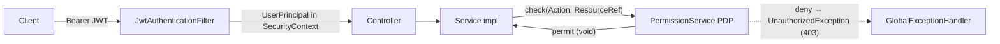
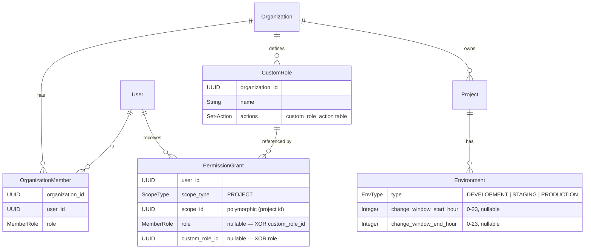
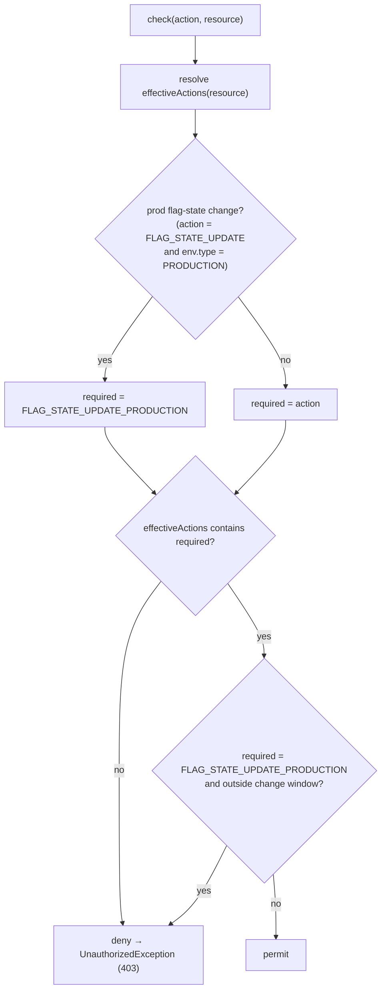

# Authorization (ABAC) — Architecture & Flow

Status: implemented on branch `feature/role`, merged up to `develop` (audit log, hashed API
keys, refresh tokens, pagination, metrics). Design spec:
[`docs/superpowers/specs/2026-07-02-abac-permissions-design.md`](superpowers/specs/2026-07-02-abac-permissions-design.md).

This document describes the Admin-API authorization model: how a request is authorized, the
data model behind it, the decision algorithm, the management APIs, and the security guards.

> Scope: this covers the **Admin API** (JWT-secured, human users). The **SDK API**
> (`/api/v1/sdk/**`, API-key-secured) is unaffected — it authenticates an `Environment`, not a
> user, and does no per-action authorization.

---

## 1. Model in one paragraph

Authorization is **attribute-based (ABAC)** and, concretely, **action-set based**. Every
protected operation is an [`Action`](#5-the-actionrole-matrix). For a given request, the
`PermissionService` (the **Policy Decision Point / PDP**) resolves the current user's
**effective set of actions** on the target resource, then checks whether the required action is
in that set. Effective actions come from the **union** of the user's organization role and any
**scoped grant** (a built-in role *or* a user-defined custom role). Two extra rules layer on
top: a **production capability** rule (changing a flag's state in a `PRODUCTION` environment
needs a distinct capability) and a **change-window** rule (production changes only inside a
configured time window).

This maps onto the four capabilities we set out to build:

| | Capability | Mechanism |
|---|---|---|
| **A** | Project-scoped access | `PermissionGrant` at `PROJECT` scope |
| **B** | Production protection | `FLAG_STATE_UPDATE_PRODUCTION` action, held by OWNER by default |
| **C** | Custom roles | `CustomRole` = a named set of `Action`s, referenced by a grant |
| **D** | Context conditions | Per-environment production **change window** (time-of-day) |

---

## 2. Where authorization lives



- The **admin `SecurityFilterChain`** validates the Bearer token and puts a `UserPrincipal`
  (with the user id) into the `SecurityContextHolder`. It does **not** do per-action checks.
- **Controllers contain no authorization logic** — they call the service layer.
- Each **service impl** calls `permissionService.check(action, resource)` before a protected
  operation. This is the single choke point (the PDP).
- A denied `check` throws `UnauthorizedException`, mapped by `GlobalExceptionHandler` to
  **HTTP 403**. Missing resources throw `ResourceNotFoundException` → **404**.

### The pre-ABAC adapters are still there

`requireRole(orgId, ...)`, `requireRoleForProject(projectId, ...)` and
`requireRoleForEnvironment(envId, ...)` were **not** removed — they are kept so call sites migrate
to `check` incrementally (design spec §6.5). After the merge with `develop`, `AuditService` is the
one remaining caller.

- `requireRole` is org-scoped, so it reads the org role only — grants never apply at org scope.
- The project and environment adapters resolve through `effectiveRoleForProject`, which returns the
  **more permissive** of the caller's org role and any built-in-role PROJECT grant. So a grant
  elevates an adapter call just as it elevates a `check`.
- A grant carrying a **custom role** has no built-in `MemberRole` to compare against, so it does
  **not** satisfy an adapter. Custom-role holders only get their capability through `check`.

New code should call `check`.

Key classes (`src/main/java/org/aibles/feature_flag/`):

| Concern | Type |
|---|---|
| PDP | `service/impl/PermissionService` |
| Actions | `domain/enums/Action` |
| Built-in roles | `domain/enums/MemberRole` (OWNER, ADMIN, VIEWER) |
| Scoped grant | `domain/entity/PermissionGrant`, `domain/enums/ScopeType` |
| Custom role | `domain/entity/CustomRole` |
| Env attributes | `domain/entity/Environment` (`type: EnvType`, change window) |
| Grant admin API | `service/ProjectGrantService`, `controller/admin/ProjectMemberController` |
| Custom-role admin API | `service/CustomRoleService`, `controller/admin/CustomRoleController` |
| Clock (for D) | `config/AppConfig#clock` |

---

## 3. Data model



Notes:

- **`OrganizationMember`** is the source of a user's **org-level** role and of membership.
  Untouched by this work — full backward compatibility.
- **`PermissionGrant`** elevates a user on a specific **project**. Exactly one of `role`
  (built-in) or `custom_role_id` is set (DB `CHECK` + service validation). `scope_id` is a
  polymorphic reference (project id today; no DB FK, so `ENVIRONMENT` scope can be added later).
- **`CustomRole`** is an org-scoped named set of `Action`s (`custom_role_action` join table).
- **`Environment.type`** drives production protection; the **change window** drives rule D.

### Liquibase changesets

| # | File | Adds |
|---|---|---|
| 013 | `013-add-environment-type.xml` | `environments.type` (default `DEVELOPMENT`) |
| 014 | `014-create-permission-grants.xml` | `permission_grant` table |
| 015 | `015-create-custom-roles.xml` | `custom_role`, `custom_role_action` |
| 016 | `016-permission-grant-custom-role.xml` | `permission_grant.custom_role_id`, `role` made nullable, XOR check |
| 017 | `017-add-environment-change-window.xml` | `environments.change_window_start_hour` / `_end_hour` |

No previously-run changeset was modified; no data was migrated.

---

## 4. Decision flow — `check(Action, ResourceRef)`

`ResourceRef` names the resource and its scope: `org(orgId)`, `project(projectId)`, or
`environment(projectId, environment)` (the last carries `Environment` attributes for rules
B and D).



### `effectiveActions` — how the action set is built

```
effectiveActions(user, project) =
      actionsForRole( orgRole(user, project.org) )        // org-level role, if a member
    ∪ grantActions( grant(user, PROJECT, project) )       // built-in OR custom role, if granted

effectiveActions(user, org)     =
      actionsForRole( orgRole(user, org) )                // org scope: grants do not apply
```

- **Union ⇒ grants only elevate.** A scoped grant can only *add* capability; it never
  downgrades an org OWNER/ADMIN. Org OWNER/ADMIN keep seeing everything.
- **Project isolation (A)** is delivered by granting a **non-member** (their org role is empty,
  so their only actions come from the grant) — but note grants can only target **org members**
  (see [§7](#7-security-guards)); pure "invisible to non-granted projects" read isolation is a
  deferred enhancement.
- **Org scope ignores project grants and custom roles**, so a project-scoped role can never
  confer an org-level action such as `ORG_DELETE`.

### Rule B — production capability

`FLAG_STATE_UPDATE` on a `PRODUCTION` environment is rewritten to require the distinct
`FLAG_STATE_UPDATE_PRODUCTION` action. Only OWNER holds it by default; a **custom role can
opt into it** deliberately. ADMIN can toggle dev/staging but not production. This is why B and
C share one mechanism instead of a special-cased `role == OWNER` check.

### Rule D — production change window

If the target environment sets both `changeWindowStartHour` and `changeWindowEndHour`, a
production state change is only permitted when the current local hour is inside `[start, end)`.
Windows may wrap past midnight (`start > end`, e.g. `22–06`). `start == end` (or an unset
window) means **no restriction** — never a permanent lock-out. Time comes from an injectable
`Clock` bean, so it is unit-testable.

---

## 5. The Action/role matrix

`PermissionService.ROLE_ACTIONS` is the single seam mapping built-in roles to actions
(immutable). Custom roles carry their own set instead.

| Action | VIEWER | ADMIN | OWNER |
|---|:---:|:---:|:---:|
| `*_READ` (FLAG/ENV/PROJECT) + `AUDIT_READ` | ✅ | ✅ | ✅ |
| `FLAG_CREATE` `FLAG_UPDATE` `FLAG_ARCHIVE` `FLAG_STATE_UPDATE` | | ✅ | ✅ |
| `ENV_CREATE` `ENV_UPDATE` `ENV_ROTATE_KEY` | | ✅ | ✅ |
| `PROJECT_CREATE` `PROJECT_UPDATE` | | ✅ | ✅ |
| `ORG_UPDATE` `MEMBER_INVITE` `MEMBER_MANAGE` | | ✅ | ✅ |
| `GRANT_MANAGE` `ROLE_MANAGE` | | ✅ | ✅ |
| `FLAG_DELETE` `ENV_DELETE` `PROJECT_DELETE` `ORG_DELETE` | | | ✅ |
| `FLAG_STATE_UPDATE_PRODUCTION` | | | ✅ |
| `ENV_MANAGE_PROTECTION` (edit env `type` / change window) | | | ✅ |

This matrix exactly preserves the pre-ABAC role behavior of every call site; the only
intentional change is that production flag-state toggling now needs the OWNER-only
`FLAG_STATE_UPDATE_PRODUCTION`.

---

## 6. Management APIs

### Project grants — `/api/v1/projects/{projectId}/members`

Guarded by `GRANT_MANAGE` on the project (org OWNER/ADMIN, or a project OWNER/ADMIN grant).

| Method | Path | Body | Effect |
|---|---|---|---|
| GET | `/members` | — | list project grants |
| POST | `/members` | `{ userId, role? , customRoleId? }` | create/update a grant (upsert) |
| DELETE | `/members/{userId}` | — | revoke a grant |

Provide **exactly one** of `role` or `customRoleId`.

Every grant and revoke writes an audit row (`PERMISSION_GRANT` / `GRANT_PERMISSION` and
`REVOKE_PERMISSION`), in the same transaction as the change. On an upsert over an existing grant the
`before` state is what was replaced; a fresh grant has none.

### Custom roles — `/api/v1/organizations/{orgId}/roles`

Guarded by `ROLE_MANAGE` on the organization.

| Method | Path | Body | Effect |
|---|---|---|---|
| GET | `/roles` | — | list custom roles |
| POST | `/roles` | `{ name, actions[] }` | create |
| PUT | `/roles/{roleId}` | `{ name, actions[] }` | replace |
| DELETE | `/roles/{roleId}` | — | delete (cascades to its grants) |

Create / update / delete each write a `CUSTOM_ROLE` audit row, so a role's action set can be traced
back through its edits.

### Environment attributes — existing environment endpoints

`POST`/`PUT /api/v1/environments/...` accept `type` (`DEVELOPMENT`/`STAGING`/`PRODUCTION`) and
the optional `changeWindowStartHour` / `changeWindowEndHour` (0–23, validated).

---

## 7. Security guards

The definition and delegation points are constrained so no one can confer authority beyond
their own:

- **Grant ceiling (subset).** In `ProjectGrantServiceImpl`, `upsertGrant`/`revokeGrant`
  require the caller's own effective actions on the project to be a **superset** of the
  grant's actions. An ADMIN cannot grant (or revoke) OWNER-level capability, and cannot
  self-escalate.
- **Custom-role ceiling (subset).** In `CustomRoleServiceImpl`, `create`/`update`/`delete`
  require the caller's org-level actions to include every action the role confers. This closes
  the "create a benign role, grant it to self, then expand it" escalation — and stops an ADMIN
  from deleting (cascade-revoking) an OWNER-authored elevated role.
- **Tenant isolation.** A grant may only target a **member of the project's organization**; a
  custom role referenced by a grant must belong to the **same organization** as the project.
- **Org scope excludes project authority.** Org-level `check` uses only the org role, so a
  project custom role can never yield an org-level action.
- **Protection attributes are OWNER-only.** Changing an environment's `type` or change window
  requires `ENV_MANAGE_PROTECTION` (OWNER), so a lower role cannot strip production protection
  to dodge rules B/D.
- **Invite ceiling.** `inviteMember` cannot grant an org role more permissive than the
  inviter's own — an ADMIN cannot mint an OWNER.
- **Removal revokes grants.** `removeMember` also deletes the user's project grants in that
  org, so grants (which outlive membership) don't leave stale access.

---

## 8. Worked examples

- **A — project collaborator.** Alice is granted `PROJECT` role `ADMIN` on project *Mobile*.
  She can create/toggle flags and manage envs in *Mobile*, but has no access to project
  *Billing* (no grant, and if she is not an org member, no cascade).
- **B — production protection.** Bob is org `ADMIN`. He toggles a flag on *staging* (`200`),
  but toggling the same flag on the *production* environment returns `403` — he lacks
  `FLAG_STATE_UPDATE_PRODUCTION`. An OWNER succeeds.
- **C — Release Manager custom role.** An OWNER creates role *Release Manager* =
  `{FLAG_READ, FLAG_STATE_UPDATE, FLAG_STATE_UPDATE_PRODUCTION}` and grants it to Carol on
  *Mobile*. Carol can toggle production flags there but cannot delete flags or manage envs.
- **D — change window.** *Mobile*'s production env sets window `9–17`. Even an OWNER toggling a
  production flag at `20:00` gets `403` ("outside the change window"); at `10:00` it succeeds.

---

## 9. Operational notes

- **⚠️ Production protection is not retroactive.** Migration 013 backfills every existing
  environment's `type` to `DEVELOPMENT`. After deploying to an environment with existing data,
  **re-classify real production environments** (`PUT /environments/{id}` with
  `type=PRODUCTION`), otherwise rule B/D will not apply to them. This cannot be auto-detected.

---

## 10. Extension points (deferred)

- **Environment-scoped grants** — `ScopeType` already reserves room; `PermissionGrant.scopeId`
  is polymorphic.
- **More context conditions (D)** — the change-window check is the seam. IP allowlists,
  change-freeze windows, or four-eyes approval would plug into `check()` (add inputs to a
  policy context; today only the `Clock` is threaded in).
- **Read/list isolation** — hiding non-granted projects from an org member's reads is out of
  scope (grants are additive-elevation only today).

---

## 11. Tests

- `service/impl/PermissionServiceTest` — action matrix, effective-action resolution (org ∪
  grant, built-in & custom), production capability (B/C), change window (D, incl. wrap and
  zero-width), **plus** the retained `requireRole*` adapter cases including grant elevation.
- `service/impl/ProjectGrantServiceImplTest` — grant subset ceiling, tenant-membership
  requirement, cross-org custom role rejection.
- `service/impl/CustomRoleServiceImplTest` — custom-role ceiling on create/update/delete.
- `service/impl/EnvironmentServiceImplTest` — `ENV_MANAGE_PROTECTION` guard on `type` and change
  window, alongside develop's hashing/audit coverage.
- `service/impl/OrganizationServiceImplTest` — invite ceiling and grant revocation on member
  removal, alongside develop's coverage.
- `security/SecurityChainIntegrationTest` — `@SpringBootTest`; boots the full context and runs
  migrations 001–011 and 013–017 on H2.

---

## 12. Known gaps after the merge with `develop`

`develop` grew features while this branch was open. The two places where the two models genuinely
disagreed are now reconciled:

- ~~Audit reads outside the action vocabulary~~ — `AUDIT_READ` is an `Action` held by VIEWER and
  above, and `AuditService.list` gates on it, so a custom role can confer audit access.
- ~~Permission changes not audited~~ — grants and custom-role edits write audit rows
  (`PERMISSION_GRANT`, `CUSTOM_ROLE`) in the same transaction as the change.

What is left is convention drift rather than a design mismatch:

- **The management list endpoints are unpaginated.** They return `List<>`, while every other admin
  list endpoint returns `PageResponse<>` with a `Pageable` (ADR-0003).
- **URL spelling is inconsistent.** `CustomRoleController` maps `/api/v1/organizations/{orgId}/roles`
  whereas the rest of the API uses `organisations`.
- **`EnvironmentSecretResponse`** (create / rotate-key response) does not carry `type` or the change
  window, so those values are invisible in the response that sets them.
- **The Postman collection** has no requests for project grants or custom roles.
