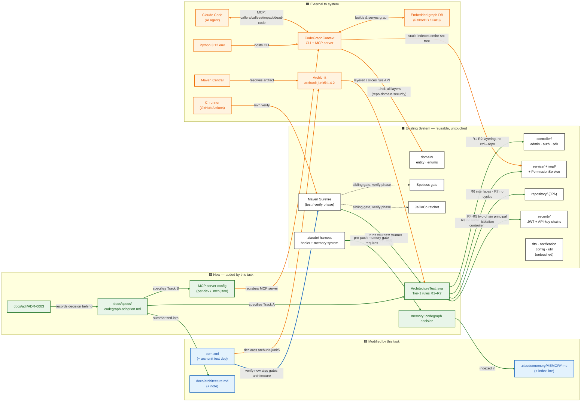

# Spec: Code Graph Adoption — ArchUnit (Governance) + CodeGraphContext MCP (Agent Queries)

**Status:** Proposed
**Date:** 2026-07-10
**Owner:** feature_flag team (2 devs)
**Scope:** Two independent, complementary tracks. Track A ships first; Track B is optional and layered on top.

---

## 0. Background & decision

We develop `feature_flag` (Java 21 / Spring Boot 4.1 / Maven, ~7k LOC) *with* an AI coding agent. Several of the codebase's correctness rules are **relationship-shaped** (call/dependency/data-flow) and are today enforced only by human review — exactly the class of question a *code graph* answers and grep/embeddings cannot.

We adopt a code graph via **two tools for two distinct goals** (they have different best tools; do not force one to serve both):

| Goal | Tool | What it delivers |
|------|------|------------------|
| **A — Governance** | **ArchUnit** (JUnit test library) | Architecture invariants enforced as CI-gating tests in `mvn verify`. Zero new infra. |
| **B — Agent queries** | **CodeGraphContext** (MCP server) | Claude Code gains callers/callees/reachability/impact/dead-code queries over a live-indexed graph. |

Rejected alternatives and rationale live in the companion ADR (see §7). Summary: jQAssistant+Neo4j is the "one precise graph for both goals" upgrade path but costs operating Neo4j; Sourcegraph/scip-java are enterprise/dead-ends; building our own is not justified at this scale.

---

## Track A — ArchUnit (Governance)

### A.1 Goal

Turn the prose invariants in `CLAUDE.md` into **executable, build-gating** tests so a violation fails `mvn verify` in the same pipeline as Spotless and the JaCoCo ratchet.

### A.2 Repository facts the rules bind to (verified 2026-07-10)

- Root package: `org.aibles.feature_flag`
- Layers (packages):
  - `controller` (+ `controller.admin`, `controller.auth`, `controller.sdk`) — 6 `@RestController` classes
  - `service` — 6 interfaces (`AuthService`, `EnvironmentService`, `EvaluationService`, `FeatureFlagService`, `OrganizationService`, `ProjectService`)
  - `service.impl` — 6 `*ServiceImpl` + `PermissionService` (a `@Service` helper, no interface)
  - `repository` — 7 interfaces extending `JpaRepository`
  - `domain.entity`, `domain.enums`
  - `security` (+ `security.ratelimit`)
  - `dto.request`, `dto.response`
  - `notification` (+ `notification.event`)
  - `config`, `exception`, `util`
- Authorization helper: `PermissionService` with `requireRole`, `requireRoleForProject`, `requireRoleForEnvironment`, `isMember`, `currentUserId`, `currentUserEmail`. `MemberRole` enum = `OWNER | ADMIN | VIEWER`.
- Immutable slug: `FeatureFlag.key` is `@Column(name="key", nullable=false, updatable=false)`.
- Two security chains: `JwtAuthenticationFilter` (sets `UserPrincipal`) vs `ApiKeyAuthenticationFilter` (sets `ApiKeyAuthenticationToken`/`Environment`), wired in `config.SecurityConfig`.

### A.3 Dependency to add (`pom.xml`, test scope)

```xml
<dependency>
    <groupId>com.tngtech.archunit</groupId>
    <artifactId>archunit-junit5</artifactId>
    <version>1.4.2</version>
    <scope>test</scope>
</dependency>
```

No plugin change needed: ArchUnit rules are JUnit 5 tests, already run by Surefire during `mvn test`/`verify`. They gate CI automatically alongside the existing Spotless + JaCoCo executions.

### A.4 Rules — split by what ArchUnit can vs. cannot soundly prove

ArchUnit reasons over **bytecode dependencies and access edges** (class→class, method→field, method→method access). It is exact for *structural* rules. It is **not** a data-flow engine — it cannot prove statement ordering ("guard is called *before* the mutation") or true reachability with sanitizers. Rules are therefore tiered.

#### Tier 1 — Directly & soundly enforceable (ship these)

Location: `src/test/java/org/aibles/feature_flag/architecture/ArchitectureTest.java`

```java
package org.aibles.feature_flag.architecture;

import static com.tngtech.archunit.library.Architectures.layeredArchitecture;
import static com.tngtech.archunit.lang.syntax.ArchRuleDefinition.*;

import com.tngtech.archunit.core.domain.JavaClasses;
import com.tngtech.archunit.junit.AnalyzeClasses;
import com.tngtech.archunit.junit.ArchTest;
import com.tngtech.archunit.lang.ArchRule;

@AnalyzeClasses(
    packages = "org.aibles.feature_flag",
    importOptions = {com.tngtech.archunit.core.importer.ImportOption.DoNotIncludeTests.class})
class ArchitectureTest {

  // R1: Layering — Controller -> Service -> Repository. No skips, no back-edges.
  @ArchTest
  static final ArchRule layering =
      layeredArchitecture().consideringAllDependencies()
          .layer("Controller").definedBy("..controller..")
          .layer("Service").definedBy("..service..")
          .layer("Repository").definedBy("..repository..")
          .whereLayer("Controller").mayNotBeAccessedByAnyLayer()
          .whereLayer("Repository").mayOnlyBeAccessedByLayers("Service");

  // R2: Controllers must not touch repositories directly (the invariant made explicit).
  @ArchTest
  static final ArchRule controllersDoNotUseRepositories =
      noClasses().that().resideInAPackage("..controller..")
          .should().dependOnClassesThat().resideInAPackage("..repository..");

  // R3: Controllers contain no authorization logic — only the service layer reads roles.
  //     Concretely: nothing in ..controller.. may depend on PermissionService or MemberRole.
  @ArchTest
  static final ArchRule controllersHaveNoAuthzLogic =
      noClasses().that().resideInAPackage("..controller..")
          .should().dependOnClassesThat().haveFullyQualifiedName(
              "org.aibles.feature_flag.service.impl.PermissionService")
          .orShould().dependOnClassesThat().haveFullyQualifiedName(
              "org.aibles.feature_flag.domain.enums.MemberRole");

  // R4: SecurityContextHolder principal access is centralized.
  //     Only PermissionService (admin/UserPrincipal) and the SDK EvaluationController
  //     (Environment principal) may read SecurityContextHolder — stops ad-hoc, cast-unsafe reads
  //     that mix the two chains.
  @ArchTest
  static final ArchRule securityContextAccessIsCentralized =
      classes().that().accessClassesThat()
          .haveFullyQualifiedName("org.springframework.security.core.context.SecurityContextHolder")
          .should().haveFullyQualifiedName(
              "org.aibles.feature_flag.service.impl.PermissionService")
          .orShould().haveFullyQualifiedName(
              "org.aibles.feature_flag.controller.sdk.EvaluationController")
          .as("Only PermissionService and EvaluationController may read SecurityContextHolder");

  // R5: The two auth principal types must not cross chains.
  //     UserPrincipal (admin/JWT) must never be referenced from the SDK package, and
  //     ApiKeyAuthenticationToken/Environment-principal wiring stays out of admin controllers.
  @ArchTest
  static final ArchRule userPrincipalStaysOutOfSdk =
      noClasses().that().resideInAPackage("..controller.sdk..")
          .should().dependOnClassesThat().haveFullyQualifiedName(
              "org.aibles.feature_flag.security.UserPrincipal");

  // R6: Entities/DTOs boundaries — repositories are Spring Data interfaces only,
  //     services depend on interfaces not each other's impls where avoidable.
  @ArchTest
  static final ArchRule repositoriesAreInterfaces =
      classes().that().resideInAPackage("..repository..")
          .and().haveSimpleNameEndingWith("Repository")
          .should().beInterfaces();

  // R7: No package cycles across the top-level slices.
  @ArchTest
  static final ArchRule noCycles =
      com.tngtech.archunit.library.dependencies.SlicesRuleDefinition.slices()
          .matching("org.aibles.feature_flag.(*)..")
          .should().beFreeOfCycles();
}
```

#### Tier 2 — Enforceable with a custom `ArchCondition` (ship after Tier 1 is green)

- **Immutable `FeatureFlag.key`** — assert no method *sets* the `key` field except the entity's own construction/builder path. Implement with a field-access condition: `noClasses().should().setFieldWhere(field is FeatureFlag.key AND owner not in {FeatureFlag, the builder})`. The `@Column(updatable=false)` already backs this at the DB level; the ArchUnit rule makes the *code* boundary explicit and catches an accidental `setKey(...)` at compile-time-of-tests.

- **`update()` must not read the request's key field** — approximate via "`FeatureFlagServiceImpl.update` does not call `UpdateFeatureFlagRequest.getKey()`". This is a method-call condition (ArchUnit can see the call edge); it is sound because it checks an *access edge*, not ordering.

#### Tier 3 — NOT soundly expressible in ArchUnit (defer to jQAssistant/Cypher — see §7 upgrade path)

These are genuine data-flow / ordering properties. Document them here so we don't fool ourselves that ArchUnit covers them:

- **"Every `@Transactional` mutating service method calls a `PermissionService.require*` guard before mutating."** ArchUnit can check *that a class depends on* PermissionService, but not that *each mutating method* calls it, nor ordering. Best ArchUnit approximation: `classes in service.impl that access repositories should also access PermissionService` (class-level, coarse). True per-method proof needs a call-graph query (jQAssistant Cypher: `@Transactional` method with no `INVOKES*` path to `requireRole`).
- **"Never query `FeatureFlag` without joining `FlagEnvironmentState`."** A data/query-shape invariant; not a static class-dependency. Needs graph/data-flow analysis or a repository-method naming convention lint.
- **Taint: raw `getHeader(...)` reaching a sink without validation.** Requires a Code Property Graph (Joern) — out of scope for both tracks; hold in reserve.

### A.5 Rollout (Track A)

1. Add the dependency (A.3) and `ArchitectureTest.java` with **Tier 1** rules only.
2. Run `./mvnw test -Dtest=ArchitectureTest`. Expect current code to **pass** (design is already clean per prior analysis); if any rule reports pre-existing violations we don't intend to fix immediately, wrap that rule in `FreezingArchRule.freeze(rule)` so it records today's violations as a baseline and gates only *new* ones.
3. Confirm it runs under `./mvnw verify` (it does — Surefire).
4. Commit. Add a one-line note to `docs/architecture.md` and a memory entry (`/save-memory`) — required by the pre-push memory gate.
5. Follow up with **Tier 2** rules in a separate PR once Tier 1 is stable.

### A.6 Acceptance criteria (Track A)

- [ ] `archunit-junit5:1.4.2` present in `pom.xml` test scope.
- [ ] `ArchitectureTest` with rules R1–R7 exists and passes on current `develop`.
- [ ] A deliberately-introduced violation (e.g. a controller calling a repository) fails `./mvnw verify` locally. **This negative test is the real proof the gate works** — demonstrate it, then revert.
- [ ] CI runs the test (no pipeline change needed; verify the run log shows `ArchitectureTest`).
- [ ] Tier 3 gaps documented (they are, in A.4) so coverage is not overclaimed.

### A.7 Effort / risk (Track A)

- Effort: ~½ day for Tier 1, ~½ day for Tier 2.
- Risk: very low. No new runtime infra, no new services, Apache-2.0 license. Only risk is a rule being too strict → use `FreezingArchRule` to adopt gradually.

---

## Track B — CodeGraphContext MCP (Agent Queries)

### B.1 Goal

Give Claude Code a **graph query interface** over this repo so it can answer *callers/callees/reachability/impact/dead-code* precisely instead of grep→read loops — reducing tool-call churn and false positives on common names (`update`, `value`, `save`).

### B.2 What it is

`CodeGraphContext` — an MCP server + CLI that indexes local source (tree-sitter, Java first-class, resolves Lombok-generated members) into an embedded graph DB and exposes graph tools to the agent. Real-time file-watch reindex. MIT, active (~3.9k★), **alpha**.

**Known limitation (state honestly):** Java call resolution is **tree-sitter heuristic** — approximate through Spring `@Autowired`/interface→impl/proxied beans. Good enough for *navigation*; **not** authoritative for "provably nothing calls X". That's fine because Track A (bytecode-exact ArchUnit) owns the provable-governance job; Track B is a *navigation aid* for the agent. If approximate Java edges prove too lossy in practice, the upgrade is **FalkorDB code-graph** (LSP-accurate resolution, ships `impact_analysis`/`find_path` + a Claude Code skill; cost = running a FalkorDB/Redis container).

> **⚠️ Executed 2026-08-15 (issue #50) — B.3/B.4 below are the original proposal and are partly
> wrong in practice. See [ADR-0005](../adr/ADR-0005-codegraph-mcp-track-b.md) for what actually
> works.** In short: the Python 3.13 warning is **stale** (3.13.10 installs fine, 8/8 tree-sitter
> parsers OK incl. Java); **FalkorDB Lite does not exist on Windows at any Python version**
> (`redislite` is unsupported on win32) so the backend must be `kuzudb`; and `cgc mcp setup` has no
> Claude Code CLI target — register with `claude mcp add` instead.

### B.3 Prerequisites

- **Python 3.10–3.12** (⚠️ tree-sitter bindings break on 3.13; 3.14 also OK per project notes — pin to 3.12 to be safe). This is a **dev-machine tool**, not a project runtime dependency — it does not touch `pom.xml` or the JVM build.
- Embedded graph DB (FalkorDB Lite default, or KuzuDB fallback) — **no DB server to operate**.

### B.4 Setup

```bash
# 1. Install (use a dedicated venv / pipx to avoid polluting system Python)
pipx install codegraphcontext        # or: pip install codegraphcontext

# 2. Wire it into Claude Code's MCP config
codegraphcontext mcp setup           # writes the MCP server entry for Claude Code

# 3. Index this repo
cd /Users/leonard/workspace/code/aibles/onward/feature_flag
codegraphcontext index .

# 4. Keep the graph fresh while developing
codegraphcontext watch .             # real-time reindex on file changes
```

The resulting MCP entry (for reference — `mcp setup` generates it) lives in the Claude Code MCP config, **not** in the repo's `.mcp.json` unless we choose to commit a shared config. Recommendation: keep it **per-developer / uncommitted** initially (it's an alpha dev aid); promote to committed `.mcp.json` only once the team agrees it's stable.

### B.5 Queries the agent gains

| MCP tool | What the agent can now do | Grep equivalent (worse) |
|----------|---------------------------|-------------------------|
| `analyze_code_relationships` (callers/callees/chains) | "All callers of `PermissionService.requireRoleForProject`" → resolved set | `grep -r "requireRoleForProject"` → raw lines to read/filter |
| `find_code` | Locate a symbol/definition by structure | name-based grep, false positives |
| `find_dead_code` | Zero-incoming-edge scan | impossible to prove with grep |
| `execute_cypher_query` | Ad-hoc structural questions | n/a |
| complexity / inheritance | Hotspots, class hierarchy | n/a |

Concrete wins on *this* repo (from the code map): instant blast-radius for `FeatureFlagServiceImpl.updateState()` (1 caller + async Slack listener), the notification publisher→listener chain, and the `FeatureFlagServiceImpl.create()` → per-environment `FlagEnvironmentState` fan-out.

### B.6 Staleness & workflow

- Run `codegraphcontext watch .` during active development; otherwise `index .` before a heavy navigation/refactor session.
- The graph reflects **source at index time** — treat agent graph answers as "as of last index"; for provable claims defer to Track A.

### B.7 Acceptance criteria (Track B)

- [ ] `codegraphcontext` installed on a dev machine under Python 3.12.
- [ ] `mcp setup` done; Claude Code lists the server and its tools are callable.
- [ ] `index .` completes on this repo without error; a sample query ("callers of `PermissionService.requireRole`") returns the known ~4-impl call-site set.
- [ ] Team decision recorded: keep MCP config per-dev (default) vs commit to `.mcp.json`.
- [ ] Limitation noted in team docs: Java edges are approximate; not for provable-absence claims.

### B.8 Effort / risk (Track B)

- Effort: ~1 hour to stand up.
- Risk: low but it's **alpha** — treat as an experiment. No repo/runtime coupling (dev-machine only), easily removed. Python-version pin is the main gotcha.

---

## 7. Upgrade path & rejected options

**If we later want ONE bytecode-precise graph serving both goals** → migrate governance to **jQAssistant 2.9.1 + Spring plugin** (embedded Neo4j, Cypher constraints bound to `verify`) and point the official `mcp-neo4j-cypher` server at the same store so the agent queries the exact graph CI enforces. This closes the Tier 3 gaps (per-method guard coverage, layering-with-DI) that ArchUnit cannot. Cost: operating Neo4j + Cypher fluency. Adopt only when Tier 3 governance becomes a felt need.

**Hold in reserve:** **Joern/CPG** for a future security/taint review of the auth code (JWT / API-key / SDK-auth) — the one job neither ArchUnit nor CodeGraphContext does.

**Rejected:** Sourcegraph/Cody (enterprise-only since mid-2025), scip-java (query path needs Sourcegraph), jArchitect/Structure101 (paid / EOL, no agent story), build-your-own (Spring-DI resolution + parser maintenance forever, no advantage at 7k LOC; avoid Kuzu — repo archived ~Oct 2025).

## 8. Sequencing

1. **Track A, Tier 1** — highest ROI, ship first (½ day).
2. **Track B** — stand up as a dev experiment (1 hr), gather a week of real usage.
3. **Track A, Tier 2** — immutable-key + update-ignores-key conditions.
4. **Re-evaluate** jQAssistant upgrade only if Tier 3 governance or agent-query precision becomes a concrete pain.

---

## 9. Solution Design (visual)

### 9.1 Diagramming tool choice

**Chosen: Mermaid** (`flowchart`). Rationale for this repo:

- Renders **inline in the IDE and GitHub** with no build step — the doc is already Markdown.
- **Text = git-diffable and easy to edit** in-place (the stated requirement).
- Supports the required **4-colour scheme**: per-node colour via `classDef`, per-edge colour via `linkStyle`.

Alternatives considered: **D2** (prettier out-of-the-box, better big-graph layout, but needs a CLI/render step and isn't native in GitHub Markdown) — use if the diagram outgrows Mermaid's layout; **Excalidraw** (hand-drawn canvas, MCP-editable, best for live human+agent whiteboarding) — use for brainstorming, not for a versioned spec artifact.
Sources: [InfraSketch — Diagram-as-Code 2026](https://infrasketch.net/blog/best-diagram-as-code-tools-2026), [MCP.Directory — drawio vs Excalidraw vs Mermaid](https://mcp.directory/blog/drawio-vs-excalidraw-vs-mermaid-vs-penpot-skills-2026), [Mermaid flowchart syntax](https://mermaid.js.org/syntax/flowchart.html).

### 9.2 Colour legend

| Colour | Meaning |
|--------|---------|
| ⬛ **Black** | Reusable — existing component, **not modified** by this task |
| 🟦 **Blue** | **Modified / updated** by this task |
| 🟩 **Green** | **New** — added by this task |
| 🟧 **Orange/Yellow** | **External** to the system (3rd-party tool / infra) |

**Edge colouring rule (same palette):** an edge takes the colour of its *more-changed* endpoint (new > modified > reusable); any edge that **crosses the system boundary to an external component is orange**. Dotted edges = "co-exists / same phase" (no data flow).

**Scope note:** this task is **build-time + dev-time only** — it does not touch the runtime. Runtime externals (PostgreSQL, Slack) are intentionally omitted; the *black* app layers are shown only as the **analysis target** of the two tracks, not as things the task edits.

### 9.3 Diagram



### 9.4 Notes on components & connections

- **`ArchTest → {CTRL, SVC, REPO, SEC}` (green):** the four assertion targets of Tier-1. These app layers are **read-only analysis targets** — black (untouched); only the *new* assertion edges are green.
- **`SUREFIRE → ArchTest` (green) vs `POM → SUREFIRE` (blue):** the Surefire runner itself is reused (no config change), so the *test-execution* edge is green (new test); but `pom.xml` is edited so its lifecycle edge — "verify now additionally gates architecture" — is a **modified** existing flow (blue). This is the one behavioural change to the existing build.
- **`SUREFIRE ⇢ Spotless / JaCoCo` (black, dotted):** shown only to place ArchUnit as a **sibling gate** in the same `verify` phase; no data flows between them.
- **`CGC → SVC` / `CGC → DOM` (orange):** CodeGraphContext indexes the **entire** `src/main/java` tree; the two edges are representative (all layers are indexed). Orange because CGC is external.
- **`Claude Code ⇄ CGC` (orange, bidirectional):** the MCP request/response channel — the agent asks graph questions, CGC answers from the embedded graph DB.
- **`HARNESS → MEMNEW` (green):** the existing pre-push memory gate (`.claude/hooks/pre-push-memory-gate.sh`) forces a memory entry to ship with code — hence a *new* memory file is required by this task.
- **Two disconnected clusters is expected:** Track A (governance, build-time) and Track B (agent queries, dev-time) share no runtime coupling — by design (see §0). They meet only in the docs/decision trail (SPEC/ADR).

### 9.5 Self-verification (performed before hand-off)

**Component categorisation** — every node checked against the spec body:
- ⬛ Reusable: app layers (controller/service/repository/domain/security/misc) + build gates (Surefire/Spotless/JaCoCo) + `.claude` harness — task edits none of these. ✓
- 🟦 Modified: `pom.xml` (§A.3 adds dep), `docs/architecture.md` (§A.5 step 4 note), `MEMORY.md` (memory-gate index line). ✓ — all three are genuinely edited, nothing else is.
- 🟩 New: `ArchitectureTest.java` (§A.4), this spec, `ADR-0003` (§7/§8), new memory file, MCP config (§B.4). ✓
- 🟧 External: ArchUnit artifact, Maven Central, CI runner, CodeGraphContext, embedded graph DB, Python env, Claude Code. ✓ — all live outside the repo/runtime boundary.

**Colour-rule consistency** — spot-checked edges: every boundary-crossing edge (0,1,2,10,12,13,14,15,16,17) is orange; every new-relationship edge (3–7, 18–23) is green; the two reused-only edges (8,9) are black; the single modified-flow edge (11) is blue. No edge violates the "more-changed endpoint / external-wins" rule. ✓

**Completeness vs. the four requested categories** — all four present and non-empty. ✓

**Scope honesty** — runtime externals (PostgreSQL, Slack) intentionally excluded and the exclusion is stated (§9.2). Tier-3 governance gaps (data-flow rules ArchUnit can't prove) are **not** drawn as delivered — consistent with §A.4. ✓

**Mermaid syntax** — 24 edges (indices 0–23) declared before all `linkStyle` lines; every `linkStyle` index appears exactly once across the four colour buckets (0–23 fully partitioned, no overlap, no gap). `classDef`/`class` cover every node id exactly once. ✓

**Known limitation of the diagram:** `linkStyle` indices are positional — if edges are reordered/added later, the index lists in §9.3 must be re-partitioned. Flagged here so a future editor doesn't silently mis-colour edges.
